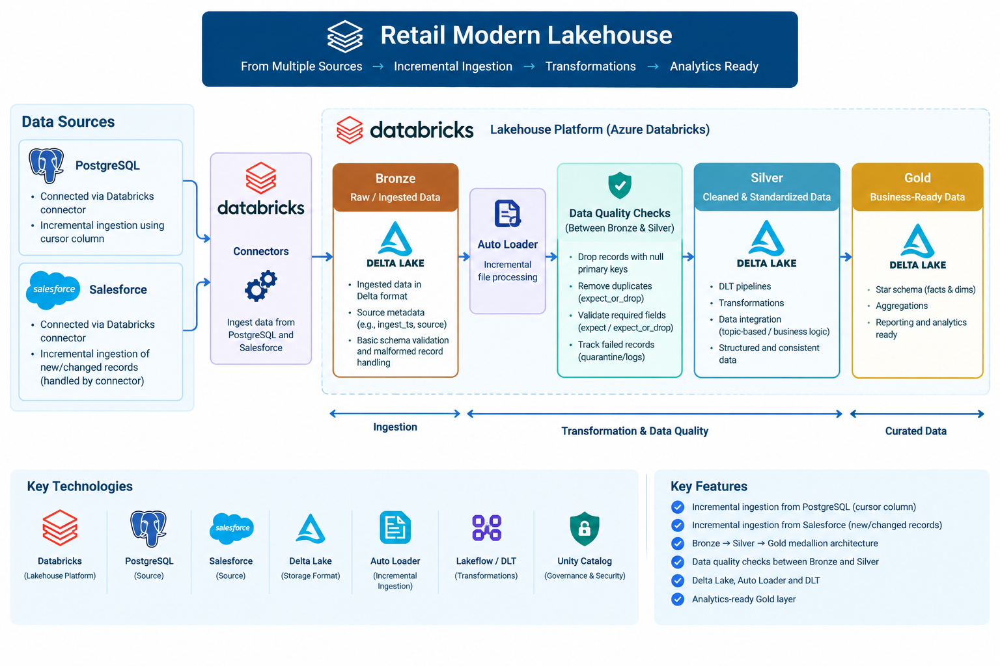

# Retail Modern Lakehouse

A modern data engineering project built using **Databricks, PostgreSQL, Salesforce, Delta Lake, Auto Loader, and Lakeflow Spark Declarative Pipelines (DLT)**.

The project demonstrates how data can be incrementally ingested from different source systems, processed through a Bronze → Silver → Gold architecture, and validated using data quality rules.  The overall process is designed to avoid repeatedly processing the entire source datasets.

## Architecture


## Technologies Used

- **Databricks**
- **PostgreSQL**
- **Salesforce**
- **Delta Lake**
- **Auto Loader**
- **Lakeflow Spark Declarative Pipelines (DLT)**
- **PySpark / Spark SQL**
- **Unity Catalog**

## Data Sources

### PostgreSQL

PostgreSQL is connected to Databricks using a Databricks connector.

The PostgreSQL source uses a **cursor column** to support incremental ingestion. Instead of extracting the complete table every time, the pipeline uses the cursor column to identify records that are new or have changed since the previous ingestion.

Example:

```text
PostgreSQL
    │
    │ Incremental extraction using cursor column
    ▼
Databricks
    │
    ▼
Bronze
```

This reduces unnecessary data extraction and processing compared with performing a full load on every pipeline run.

### Salesforce

Salesforce is also connected to Databricks using a Databricks connector.

For Salesforce, a separate cursor column does not need to be manually configured in the same way as the PostgreSQL ingestion. The Databricks connector is able to track newly created and changed records and incrementally ingest them.

```text
Salesforce
    │
    │ Databricks connector
    │ Tracks new/changed records
    ▼
Bronze
```

## Medallion Architecture

The project follows the **Bronze → Silver → Gold** lakehouse architecture.

### Bronze

The Bronze layer contains the ingested source data in Delta format.

The objective of this layer is to retain the data coming from the source systems before applying business transformations.

```text
PostgreSQL ──┐
             ├──► Bronze
Salesforce ──┘
```

### Silver

The Bronze data is processed using **Databricks Auto Loader** and **Lakeflow Spark Declarative Pipelines (DLT)**.

Transformations and data quality checks are applied as data moves from Bronze to Silver.

Examples of processing include:

- Removing invalid records
- Standardizing data
- Removing duplicate records
- Validating required fields
- Applying data quality expectations

### Gold

The Gold layer contains data that has been transformed and prepared for analytics and reporting.

The data is structured into business-ready tables that can be consumed by downstream reporting and analytical workloads.

```text
Bronze
   │  Data quality checks & DLT transformations
   │ Auto Loader
   ▼
Silver
   │
   │ DLT transformations
   │
   ▼
Gold
```

## Data Quality

Data quality checks are implemented using **DLT expectations**.

The project uses expectations to validate incoming records before they are written to the target layer.

### Drop records with missing primary keys

Records where a required primary key is null are dropped using `expect_or_drop`.

Example:

```python
@dp.expect_or_drop(
    "valid_product_id",
    "product_id IS NOT NULL"
)
```

This prevents records without a valid primary identifier from being loaded into the target table.

### Remove duplicate records

Duplicate records are also handled during the transformation process.

For example:

```python
df = df.dropDuplicates(["product_id"])
```

This ensures that multiple records with the same business identifier are not unnecessarily loaded into the Silver or Gold dataset.

### Other data quality checks

Additional expectations can be applied to validate fields such as:

```python
@dp.expect_or_drop(
    "valid_product_name",
    "product_name IS NOT NULL"
)

@dp.expect(
    "valid_price",
    "unit_price > 0"
)
```

`expect_or_drop` is used where a record should not continue through the pipeline when it fails a critical validation.

`expect` can be used where the record should remain available but the data quality failure should still be tracked.


## Key Features

- Incremental ingestion from PostgreSQL using a cursor column
- Incremental ingestion from Salesforce using Databricks connectors
- Bronze, Silver, and Gold medallion architecture
- Delta Lake tables
- Auto Loader for incremental file processing
- Lakeflow Spark Declarative Pipelines (DLT) for transformations
- Data quality expectations
- Dropping records with missing required keys
- Duplicate record handling
- Analytics-ready Gold layer

## What I Learned

Through this project, I practiced:

- Connecting Databricks to different source systems
- Designing incremental ingestion processes
- Working with Databricks connectors
- Using cursor-based incremental extraction
- Using Auto Loader for incremental processing
- Building DLT pipelines
- Applying data quality expectations
- Working with Delta tables
- Implementing Bronze → Silver → Gold processing
- Designing data pipelines that minimize unnecessary full data loads
